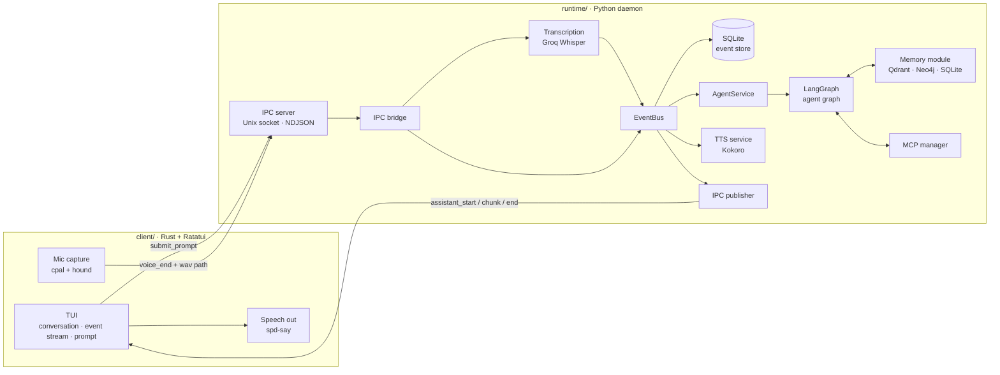
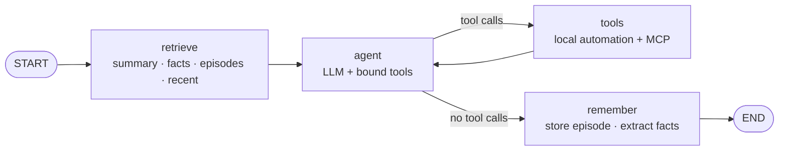
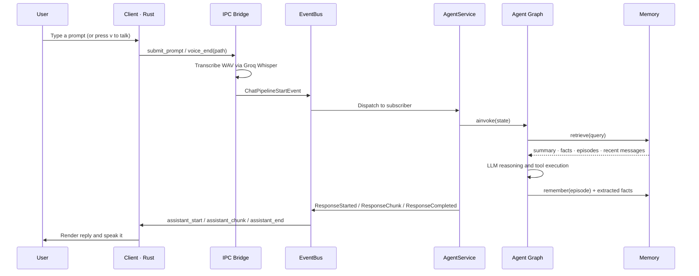
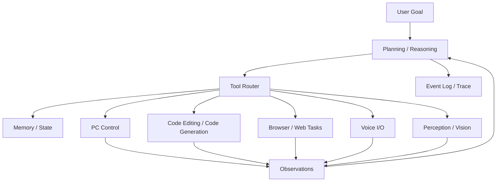

# ORION

<p align="center">
  
</p>

<p align="center">
  
  
  
  
  
</p>

ORION is a unified intelligent system designed to combine reasoning, perception, memory, planning, and execution into a single event-driven platform.

It is not just a chatbot. The codebase implements a memory-aware agent runtime that runs as a background daemon, a terminal client that talks to it over a Unix socket, a LangGraph agent that retrieves long-term memory and calls both local and MCP tools, and an event store that records every step. The longer-term goal is to grow this into a modular intelligence platform that can understand goals, manage context, coordinate tools, and eventually control a computer and assist with coding tasks in the style of modern agentic systems.

## What ORION Is Today

ORION runs as **two processes** that communicate over a Unix domain socket:

- **`runtime/`** — a Python daemon that owns the event bus, the agent, memory, MCP servers, and the event store. It never touches audio hardware.
- **`client/`** — a Rust (Ratatui) terminal client that owns the terminal, the microphone, and speech output.

Everything crossing the boundary is a newline-delimited JSON envelope with a `type` and a `payload`.

### How a Request Flows

1. The client connects to `/tmp/orion.sock` and renders the TUI.
2. You type a prompt (`i` for insert mode, `Enter` to send) or press `v` to record your voice.
3. For voice, the client captures the microphone to a 16-bit PCM WAV and sends the runtime the file path; the runtime transcribes it with Groq Whisper.
4. Either path publishes a `ChatPipelineStartEvent` onto the event bus.
5. The `AgentService` builds a LangGraph graph and invokes it: retrieve memory → reason → call tools → loop → remember.
6. The response is published as `assistant_start` / `assistant_chunk` / `assistant_end` messages over IPC.
7. The client streams the reply into the conversation panel and speaks it through the system speech engine.
8. Every event is appended to SQLite on the way through the bus, and mirrored into the client's live event stream panel.

### Current Capabilities

- Event-driven orchestration with a shared bus and a strict lifecycle (`OrionRuntime` → components → services)
- Persistent event storage in SQLite, written before any handler runs
- Pluggable LLM provider layer — Google Gemini (default) or Groq, selected by environment variable
- LangGraph agent with a `retrieve → agent → tools → remember` loop
- Long-term memory: Qdrant vector recall, a Neo4j knowledge graph of extracted facts, a SQLite rolling summary, and local sentence-transformer embeddings
- Automatic fact extraction after each turn, written to the knowledge graph
- MCP client manager — starts configured servers, discovers their tools, routes calls, and publishes lifecycle/execution events
- Local automation tools (open browser/URL/terminal/file manager, launch applications, run shell commands)
- IPC transport — Unix socket server, NDJSON protocol, typed Pydantic envelopes, per-client sessions
- Speech-to-text via Groq Whisper (`whisper-large-v3-turbo`)
- Text-to-speech synthesis via Kokoro
- Rust terminal client with vim-style keybindings, mouse support, a live event stream, Copilot-style activity logs, and `tachyonfx` animations
- Microphone capture in the client via `cpal` + `hound`; spoken replies via `spd-say`

### Current CLI Surface

The runtime has a single entrypoint — running it starts the daemon and blocks until shutdown:

```bash
uv run orion              # or: uv run python -m orion
```

There are no subcommands. The client is a separate binary (`cargo run` in `client/`).

## Architecture

ORION is intentionally structured as small services coordinated by an event bus, split across a runtime process and a client process.



### Agent Graph



### Runtime Sequence



Every event shown above is also appended to the SQLite event store and forwarded to global observers (logging, IPC publisher).

## Repository Layout

ORION is a monorepo with two independent applications that share a single Git repository and communicate over an IPC protocol.

```text
orion/
├── runtime/                        # Python AI runtime (daemon)
│   ├── src/orion/
│   │   ├── __main__.py             # Package entrypoint
│   │   ├── agent/                  # Agent graph, nodes, state, prompts, local tools
│   │   │   └── nodes/              # retrieve · agent · remember · recall
│   │   ├── bus/                    # Event bus and subscription helpers
│   │   ├── cli/                    # Typer entrypoint (starts the daemon)
│   │   ├── core/                   # Shared utilities such as the singleton metaclass
│   │   ├── events/                 # Domain event models and registry
│   │   ├── integrations/_mcp/      # MCP config, server, manager, discovery, LangChain adapter
│   │   ├── llm/                    # Provider abstraction (Gemini, Groq) and factory
│   │   ├── memory/                 # Providers, planner, session, models
│   │   │   ├── interfaces/         # embeddings · vector · graph · summary
│   │   │   └── providers/          # sentence-transformers · qdrant · neo4j · sqlite
│   │   ├── orchestrator/           # Service wiring and startup/shutdown
│   │   ├── runtime/                # Lifecycle, runtime, application entrypoint
│   │   ├── services/               # Agent, TTS, voice recording, logging, IPC publisher
│   │   ├── store/                  # SQLite event persistence
│   │   └── transport/              # IPC server, sessions, protocol, bridge, transcription
│   ├── tests/                      # Behaviour and smoke tests
│   ├── mcp.json                    # MCP server configuration
│   ├── pyproject.toml
│   └── uv.lock
├── client/                         # Rust (Ratatui) terminal client
│   ├── src/
│   │   ├── main.rs                 # Terminal setup and async event loop
│   │   ├── app.rs                  # Application state and runtime-event handling
│   │   ├── ui.rs                   # Layout and frame composition
│   │   ├── audio.rs                # Microphone capture and speech output
│   │   ├── effects.rs              # tachyonfx animations
│   │   ├── theme.rs                # Colours and styles
│   │   ├── ipc/                    # Socket client, session, protocol, envelopes, events
│   │   └── widgets/                # header · conversation · prompt · events · status
│   └── Cargo.toml
├── assets/                         # Logo and visual assets
├── docker-compose.yml              # Qdrant + Neo4j backends for memory
└── .github/workflows/pytest.yml    # Lint, tests, and client build
```

## How It Works

### Runtime and Lifecycle

`OrionRuntime` is the top-level lifecycle manager. Components are registered in order (event store → memory → MCP manager → orchestrator → IPC server), started in registration order, and shut down in reverse. A failed shutdown is collected into an `ExceptionGroup` rather than silently swallowed.

### Event Bus

The `EventBus` is the centre of the runtime and a process-wide singleton. Every event is written to the store first, then fanned out to handlers subscribed to that exact event type and to global observers. Handlers run concurrently via `asyncio.gather`.

### Orchestrator

The orchestrator owns service wiring:

- builds runtime services from a `ServiceContext` (LLM, memory, MCP manager)
- registers each service's event subscriptions
- starts every service
- subscribes global observers (`LoggingService`, `IPCPublisherService`)
- tears everything down in reverse on exit

### Services

- `AgentService` — subscribes to `ChatPipelineStartEvent`, builds the graph with per-request memory and MCP tools, and publishes the response events
- `TTSService` — subscribes to `ResponseCompletedEvent` and synthesizes speech with Kokoro into `data/audio/`
- `VoiceRecordingService` — server-side VAD recorder, retained but currently dormant (see [Current State](#current-state-and-known-gaps))
- `LoggingService` — global observer that logs the full event stream
- `IPCPublisherService` — global observer that translates events into IPC envelopes for the originating client session

### IPC Transport

`IPCServer` accepts Unix socket connections and creates a `ClientSession` per client. `IPCBridge` translates in both directions: inbound envelopes become domain events (`submit_prompt` → `ChatPipelineStartEvent`, `voice_end` → transcribe then `ChatPipelineStartEvent`), and outbound events become envelopes routed to the right session. Messages are NDJSON-encoded Pydantic models, so both ends validate what they receive.

### Memory

`MemoryModule` owns four providers behind interfaces:

| Concern | Provider | Backend |
| --- | --- | --- |
| Embeddings | `SentenceTransformerEmbeddingProvider` | local model (default `BAAI/bge-small-en-v1.5`) |
| Semantic recall | `QdrantVectorMemory` | Qdrant |
| Facts | `Neo4jKnowledgeGraph` | Neo4j |
| Rolling summary | `SQLiteSummaryStore` | SQLite |

A `MemorySession` is bound to one pipeline execution. `retrieve()` fans out across the summary, graph facts, semantic matches, and recent history in parallel, and publishes an event for each step so the client can trace it. After each turn, `RememberNode` stores the episode and asks the LLM to extract stable long-term facts about the user, which are written to the graph.

`RetrievalPlanner` is wired up on both the memory module and the agent service but is not called yet — retrieval currently uses the fixed fan-out above rather than an LLM-chosen strategy.

### MCP Integrations

`MCPManager` starts every enabled server from `mcp.json`, discovers its tools, keeps a tool → server routing table (first server to claim a name wins), and exposes the tools to the agent as LangChain tools. A server that fails to start does not prevent the others from starting. Every server and tool-call outcome is published as an event.

### Client

The client runs a single-threaded Tokio runtime (the audio input stream is `!Send`) and drives a `tokio::select!` loop over three sources: a ~30 FPS render tick, terminal input, and the IPC event stream. State lives in `App`, rendering lives in `ui.rs`, and `effects.rs` post-processes the composed buffer.

## Requirements

- Python 3.11+ and [`uv`](https://docs.astral.sh/uv/)
- Rust 1.85+ (the client uses edition 2024)
- Docker (for the Qdrant and Neo4j memory backends)
- An API key for the configured LLM provider — `GEMINI_API_KEY` or `GROQ_API_KEY`
- `GROQ_API_KEY` for voice input (transcription always uses Groq Whisper)
- Audio input device (voice input) and `speech-dispatcher` / `spd-say` (spoken replies) — both optional; typing works without either
- On Linux, ALSA headers for the client's audio capture: `libasound2-dev` (Debian/Ubuntu) or `alsa-lib` (Arch)
- Node.js / `npx` if you keep the default filesystem MCP server

The first runtime start downloads the embedding model and Kokoro voice weights, so expect it to take a while.

## Installation

```bash
# Python runtime
cd runtime
uv sync

# Rust client
cd ../client
cargo build
```

If you are not using `uv`, install the dependencies from `runtime/pyproject.toml` using your preferred Python tooling.

## Configuration

Create a `.env` file inside `runtime/`:

```env
# LLM
ORION_LLM_PROVIDER=gemini               # gemini | groq
ORION_LLM_MODEL=gemini-3.1-flash-lite   # required — no default
GEMINI_API_KEY=your_key_here
GROQ_API_KEY=your_key_here              # also used for voice transcription

# Memory
NEO4J_PASSWORD=orion123                 # matches docker-compose.yml
```

Everything else has a working local default:

| Variable | Default | Purpose |
| --- | --- | --- |
| `ORION_LLM_PROVIDER` | `gemini` | Which provider the LLM factory builds |
| `ORION_LLM_MODEL` | — | Model id; the provider raises if unset |
| `GEMINI_API_KEY` | — | Required when the provider is `gemini` |
| `GROQ_API_KEY` | — | Required when the provider is `groq`, and for transcription |
| `ORION_SQLITE_DB` | `orion.db` | SQLite database for the rolling summary |
| `ORION_EMBEDDING_MODEL` | `BAAI/bge-small-en-v1.5` | Sentence-transformer embedding model |
| `QDRANT_HOST` / `QDRANT_PORT` | `localhost` / `6333` | Qdrant connection |
| `NEO4J_URI` | `bolt://localhost:7687` | Neo4j connection |
| `NEO4J_USERNAME` / `NEO4J_PASSWORD` | `neo4j` / empty | Neo4j credentials |
| `MCP_CONFIG` | `mcp.json` | Path to the MCP server configuration |
| `SOCKET_PATH` | `/tmp/orion.sock` | Unix socket the runtime listens on |

> The client's socket path is currently compiled in as `/tmp/orion.sock`, so changing `SOCKET_PATH` also requires changing `SOCKET_PATH` in `client/src/main.rs`.

### MCP Servers

`runtime/mcp.json` configures the MCP servers to start. `${PROJECT_ROOT}` resolves to the directory containing the config file, and environment variables are expanded:

```json
{
  "mcpServers": {
    "filesystem": {
      "command": "npx",
      "args": ["-y", "@modelcontextprotocol/server-filesystem", "${PROJECT_ROOT}"],
      "enabled": true
    }
  }
}
```

`stdio` (via `command` + `args`) and `http` (via `"type": "http"` + `url`) transports are supported. Set `"enabled": false` to skip a server.

### Local Artifacts

- `orion.db` — SQLite event store and summary memory
- `data/audio/*.wav` — synthesized speech output
- `logs/orion.log` — runtime log
- `$TMPDIR/orion_client_recording.wav` — the client's most recent recording

## Run

Start the memory backends, then the runtime, then the client — the runtime and client need separate terminals.

```bash
# 1. Memory backends (repo root)
docker compose up -d          # Qdrant + Neo4j

# 2. Runtime daemon
cd runtime
uv run orion                  # or: uv run python -m orion

# 3. Terminal client (second terminal)
cd client
cargo run
```

The runtime prints a startup banner and waits for connections. If the client starts first, or the socket is missing, it shows `OFFLINE` in the status bar and does not retry — start the runtime and relaunch the client.

## Client Keybindings

The client is modal, like vim. The status bar shows the current mode, connection state, activity, and event count.

**Normal mode**

| Key | Action |
| --- | --- |
| `i` / `a` | Enter insert mode |
| `v` | Toggle voice recording (press again to send) |
| `s` | Interrupt assistant speech |
| `k` / `↑`, `j` / `↓` | Scroll the conversation |
| `PageUp` / `PageDown` | Scroll by 5 lines |
| `Home` | Jump to the top |
| `End` / `G` | Jump to the bottom |
| `q` / `Esc` | Quit |

**Insert mode**

| Key | Action |
| --- | --- |
| `Enter` | Send the prompt |
| `Esc` | Back to normal mode |
| `←` / `→` | Move the cursor |
| `Backspace` | Delete a character |

`Ctrl+C` quits from either mode. Clicking the prompt box enters insert mode; clicking elsewhere returns to normal mode. The scroll wheel scrolls whichever panel is under the pointer.

## Tests

```bash
cd runtime
uv run pytest

cd ../client
cargo test
```

## Before Pushing a PR

CI runs ruff, pytest, and a client build on every push and pull request. Run the same checks locally first:

```bash
cd runtime
uv run pytest
uv run ruff check .
uv run ruff format --check .

cd ../client
cargo build
cargo test
```

If you are making code changes, it is worth running these again after your final edit so the PR starts clean.

## Current State and Known Gaps

The runtime is further along than the wiring between the two processes, so a few things are deliberately half-connected:

- **Responses are not truly token-streamed yet.** The agent publishes one `assistant_chunk` containing the whole response; the protocol and client already handle incremental chunks.
- **Kokoro output does not reach the client.** `TTSService` still synthesizes WAVs, but the speech events carry no IPC message type, so nothing is forwarded. The client speaks replies itself with `spd-say`.
- **The client only decodes a subset of messages.** `assistant_start`/`chunk`/`end`, `status`, and `error` map to typed events; everything else falls through to `Unknown`. The handlers for tool, pipeline, and voice events exist but are not yet reachable end to end.
- **Server-side voice recording is dormant.** `VoiceRecordingService` subscribes to the bare `PipelineStartEvent`, which nothing publishes anymore, and `TranscriptGenerationService` is commented out of the service list. The client owns the microphone and the runtime transcribes the file it is handed.
- **Sessions are per-connection.** Memory is global rather than scoped per client, and there is no reconnect or cancellation handling yet (`cancel_request` is defined in the protocol but not implemented).
- **`execute_shell_command` runs unsandboxed shell commands** on the host as part of the agent's tool set. Treat the runtime as trusted-local-use only.

## Planned Platform Direction

The codebase is designed to grow beyond the current loop into a broader agent platform.



This is the direction the project is heading:

- Computer control and desktop automation
- Code editing, patch generation, and code review workflows
- Multi-step task planning and execution
- Real token streaming and cancellable requests
- Multi-modal perception and interaction

## Repository Layout

ORION is a monorepo with two independent applications that share a single
Git repository and communicate over an IPC protocol:

- **`runtime/`** — the Python AI runtime (daemon).
- **`client/`** — the Rust (Ratatui) terminal client.

```text
orion/
├── runtime/                  # Python AI runtime (daemon)
│   ├── src/orion/            # Installable application package
│   │   ├── __main__.py       # Package entrypoint
│   │   ├── agent/            # Memory-aware agent graph and prompts
│   │   ├── bus/              # Event bus and subscription helpers
│   │   ├── cli/              # Typer CLI entrypoint
│   │   ├── core/             # Shared utilities such as the singleton metaclass
│   │   ├── events/           # Event models and registry
│   │   ├── integrations/     # External integrations such as MCP
│   │   ├── memory/           # Memory providers, planning, and persistence
│   │   ├── orchestrator/     # Runtime bootstrapping and pipeline entrypoint
│   │   ├── runtime/          # Runtime lifecycle and run loop
│   │   ├── services/         # Recording, STT, agent, TTS, playback, logging
│   │   ├── store/            # SQLite event persistence
│   │   └── transport/        # IPC protocol and bridge to the client
│   ├── tests/                # Behavior and smoke tests
│   ├── pyproject.toml        # Runtime metadata and dependencies
│   └── uv.lock
├── client/                   # Rust (Ratatui) terminal client
│   ├── Cargo.toml
│   └── src/main.rs
├── assets/                   # Logo and visual assets
├── docker-compose.yml        # Qdrant + Neo4j backends for memory
└── README.md
```

## How It Works

### Event Bus

The `EventBus` is the center of the runtime. Every event is written to the store first, then fanned out to subscribed handlers and global observers.

### Orchestrator

The orchestrator owns startup and shutdown:

- builds the service list
- starts each service
- subscribes logging and UI observers
- emits a `PipelineStartEvent`
- tears everything down cleanly on exit

### Services

Each service is a small, focused unit:

- `VoiceRecordingService` records microphone input and writes `data/audio/input.wav`
- `TranscriptGenerationService` sends audio to Groq Whisper and emits text
- `AgentService` turns the transcript into a response
- `TTSService` synthesizes speech into `data/audio/output.wav`
- `AudioPlaybackService` plays the response and closes the pipeline
- `TUIService` mirrors the live stream into the terminal UI
- `LoggingService` is available as a global observer hook

## Requirements

- Python 3.14+
- Audio input device
- Audio output device
- `GROQ_API_KEY` configured in the environment

## Installation

The Python runtime lives in `runtime/`:

```bash
cd runtime
uv sync
```

If you are not using `uv`, install the dependencies from `runtime/pyproject.toml` using your preferred Python tooling.

## Configuration

Create a `.env` file inside `runtime/` with your API key:

```env
GROQ_API_KEY=your_key_here
```

Optional local artifacts:

- `orion.db` - SQLite event store
- `data/audio/input.wav` - captured microphone input
- `data/audio/output.wav` - generated response audio

## Run

Start the memory backends (from the repo root), then run the runtime:

```bash
docker compose up -d          # Qdrant + Neo4j
cd runtime
uv run python -m orion        # or: uv run orion
```

## Client (Rust)

The terminal client lives in `client/` and is built with Cargo. Start the
runtime first (it opens the IPC socket the client connects to), then:

```bash
cd client
cargo run
```

The client is a Ratatui TUI that talks to the runtime over `/tmp/orion.sock`.
It renders the conversation, a live event stream, and Copilot-style activity
logs, with tachyonfx animations.

### Keybindings

| Key | Action |
|-----|--------|
| `i` | enter insert mode (type a prompt) |
| `Enter` | send the typed prompt (insert mode) |
| `Esc` | back to normal mode |
| `v` | push-to-talk: press to start recording, press again to send |
| `s` | stop the assistant's speech |
| `j`/`k`, arrows, `PgUp`/`PgDn` | scroll the conversation |
| `q` | quit |

### Voice

Voice is handled entirely by the client; the runtime never touches audio
hardware:

1. Press `v` to record from your microphone, `v` again to stop.
2. The client saves a WAV and sends its path to the runtime over IPC.
3. The runtime transcribes it (Groq Whisper) and runs the normal chat pipeline.
4. The response streams back and the client speaks it aloud.

Text-to-speech uses your system speech engine via **speech-dispatcher**. Install
it to hear responses (otherwise TTS is silently skipped):

```bash
sudo pacman -S speech-dispatcher   # Arch / EndeavourOS
# Debian/Ubuntu: sudo apt-get install -y speech-dispatcher
```

Building the client also needs the ALSA development headers for microphone
capture (`cpal`):

```bash
sudo pacman -S alsa-lib            # Arch / EndeavourOS
# Debian/Ubuntu: sudo apt-get install -y libasound2-dev
```

## Tests

```bash
cd runtime
uv run pytest
```

## Before Pushing a PR

Run the project checks locally before you push a pull request:

```bash
cd runtime
uv run pytest
uv run ruff check .
uv run ruff format --check .
```

If you are making code changes, it is worth running both commands again after your final edit so the PR starts clean.

## Notes

- `chat` is still a placeholder command.
- `doctor` is intentionally minimal right now.
- The current voice loop is continuous; it keeps starting new pipelines until the TUI exits.
- The codebase is already structured for more advanced agents, but desktop control and coding automation are still future work.

>>>>>>> b709827 (docs: add client keybindings and voice usage (v/s keys, speech-dispatcher))
=======
>>>>>>> 03ba8c4 (feat: major changes, updated mcp architecture and added multi-llm integration)
## Vision

ORION is being built toward a modular, observable intelligence system that can:

- reason over goals
- remember prior context
- perceive audio and eventually other modalities
- plan multi-step actions
- execute those actions in a controlled, auditable way
- assist with real-world tasks such as computer operation and code changes

The core principle is to keep the platform event-driven and composable, so new capabilities can be added as services without collapsing the system into one opaque monolith.
