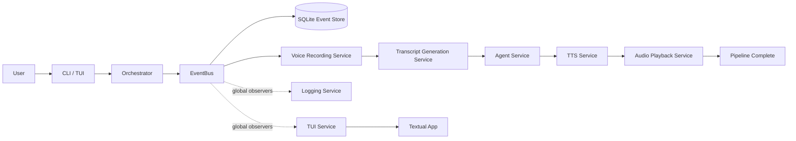
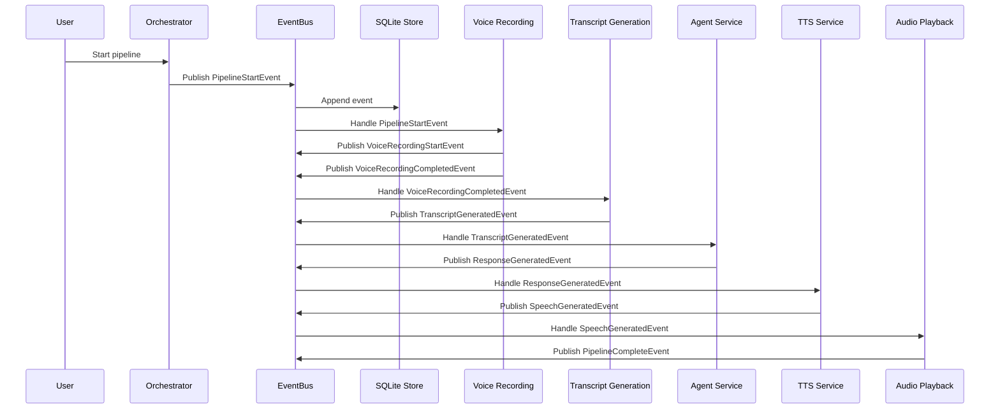
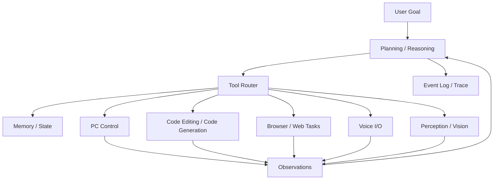

# ORION

<p align="center">
  
</p>

<p align="center">
  
  
  
  
</p>

ORION is a unified intelligent system designed to combine reasoning, perception, memory, planning, and execution into a single event-driven platform.

It is not just a chatbot. The codebase already implements a voice-first pipeline that records audio, transcribes speech, generates responses with an LLM, synthesizes speech, plays it back, and persists the full event trail in SQLite. The longer-term goal is to grow this into a modular intelligence platform that can understand goals, manage context, coordinate tools, and eventually control a computer and assist with coding tasks in the style of modern agentic systems.

## What ORION Does Today

The current implementation is centered around a strict event pipeline:

1. Start a pipeline.
2. Record microphone input.
3. Transcribe the recording with Groq Whisper.
4. Generate a response with Groq chat completions.
5. Synthesize speech with Kokoro.
6. Play the generated audio back through the speakers.
7. Persist every event into SQLite.
8. Render the live stream in a Textual terminal UI.

### Current Capabilities

- Event-driven orchestration with a shared bus
- Persistent event storage in SQLite
- Voice recording via `sounddevice`
- Speech-to-text via Groq
- Response generation via Groq chat completions
- Text-to-speech via Kokoro
- Audio playback via `sounddevice` and `soundfile`
- Live terminal interface via Textual
- CLI entrypoint via Typer

### Current CLI Surface

- `orion voice` - launches the live voice pipeline and TUI
- `orion chat` - placeholder for future chat mode
- `orion doctor` - basic environment/status check

## Architecture

ORION is intentionally structured as a pipeline of small services coordinated by an event bus.



### Runtime Sequence



## Planned Platform Direction

The codebase is designed to grow beyond voice I/O into a broader agent platform.



This is the direction the project is heading:

- Computer control and desktop automation
- Code editing, patch generation, and code review workflows
- Multi-step task planning and execution
- Persistent memory and traceability
- Multi-modal perception and interaction

## Repository Layout

ORION is a monorepo with two independent applications that share a single
Git repository and communicate over an IPC protocol:

- **`runtime/`** — the Python AI runtime (daemon).
- **`client/`** — the Rust (Ratatui) terminal client.

```text
orion/
├── runtime/                  # Python AI runtime (daemon)
│   ├── src/orion/            # Installable application package
│   │   ├── __main__.py       # Package entrypoint
│   │   ├── agent/            # Memory-aware agent graph and prompts
│   │   ├── bus/              # Event bus and subscription helpers
│   │   ├── cli/              # Typer CLI entrypoint
│   │   ├── core/             # Shared utilities such as the singleton metaclass
│   │   ├── events/           # Event models and registry
│   │   ├── integrations/     # External integrations such as MCP
│   │   ├── memory/           # Memory providers, planning, and persistence
│   │   ├── orchestrator/     # Runtime bootstrapping and pipeline entrypoint
│   │   ├── runtime/          # Runtime lifecycle and run loop
│   │   ├── services/         # Recording, STT, agent, TTS, playback, logging
│   │   ├── store/            # SQLite event persistence
│   │   └── transport/        # IPC protocol and bridge to the client
│   ├── tests/                # Behavior and smoke tests
│   ├── pyproject.toml        # Runtime metadata and dependencies
│   └── uv.lock
├── client/                   # Rust (Ratatui) terminal client
│   ├── Cargo.toml
│   └── src/main.rs
├── assets/                   # Logo and visual assets
├── docker-compose.yml        # Qdrant + Neo4j backends for memory
└── README.md
```

## How It Works

### Event Bus

The `EventBus` is the center of the runtime. Every event is written to the store first, then fanned out to subscribed handlers and global observers.

### Orchestrator

The orchestrator owns startup and shutdown:

- builds the service list
- starts each service
- subscribes logging and UI observers
- emits a `PipelineStartEvent`
- tears everything down cleanly on exit

### Services

Each service is a small, focused unit:

- `VoiceRecordingService` records microphone input and writes `data/audio/input.wav`
- `TranscriptGenerationService` sends audio to Groq Whisper and emits text
- `AgentService` turns the transcript into a response
- `TTSService` synthesizes speech into `data/audio/output.wav`
- `AudioPlaybackService` plays the response and closes the pipeline
- `TUIService` mirrors the live stream into the terminal UI
- `LoggingService` is available as a global observer hook

## Requirements

- Python 3.14+
- Audio input device
- Audio output device
- `GROQ_API_KEY` configured in the environment

## Installation

The Python runtime lives in `runtime/`:

```bash
cd runtime
uv sync
```

If you are not using `uv`, install the dependencies from `runtime/pyproject.toml` using your preferred Python tooling.

## Configuration

Create a `.env` file inside `runtime/` with your API key:

```env
GROQ_API_KEY=your_key_here
```

Optional local artifacts:

- `orion.db` - SQLite event store
- `data/audio/input.wav` - captured microphone input
- `data/audio/output.wav` - generated response audio

## Run

Start the memory backends (from the repo root), then run the runtime:

```bash
docker compose up -d          # Qdrant + Neo4j
cd runtime
uv run python -m orion        # or: uv run orion
```

## Client (Rust)

The terminal client lives in `client/` and is built with Cargo:

```bash
cd client
cargo run
```

It is currently a minimal placeholder; the Ratatui UI and the IPC bridge to the
runtime (see `runtime/src/orion/transport`) are upcoming.

## Tests

```bash
cd runtime
uv run pytest
```

## Before Pushing a PR

Run the project checks locally before you push a pull request:

```bash
cd runtime
uv run pytest
uv run ruff check .
uv run ruff format --check .
```

If you are making code changes, it is worth running both commands again after your final edit so the PR starts clean.

## Notes

- `chat` is still a placeholder command.
- `doctor` is intentionally minimal right now.
- The current voice loop is continuous; it keeps starting new pipelines until the TUI exits.
- The codebase is already structured for more advanced agents, but desktop control and coding automation are still future work.

## Vision

ORION is being built toward a modular, observable intelligence system that can:

- reason over goals
- remember prior context
- perceive audio and eventually other modalities
- plan multi-step actions
- execute those actions in a controlled, auditable way
- assist with real-world tasks such as computer operation and code changes

The core principle is to keep the platform event-driven and composable, so new capabilities can be added as services without collapsing the system into one opaque monolith.
